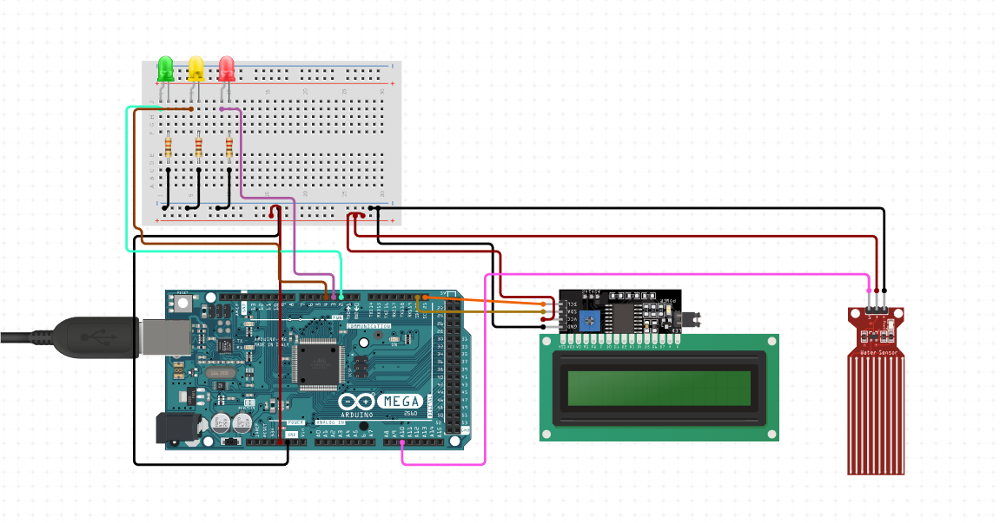
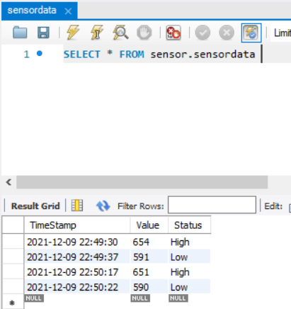
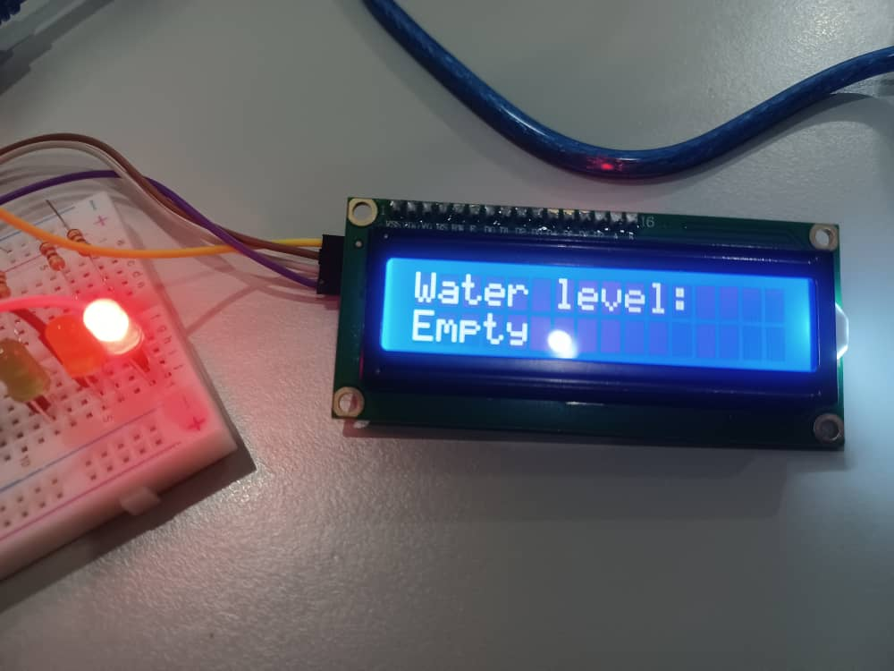
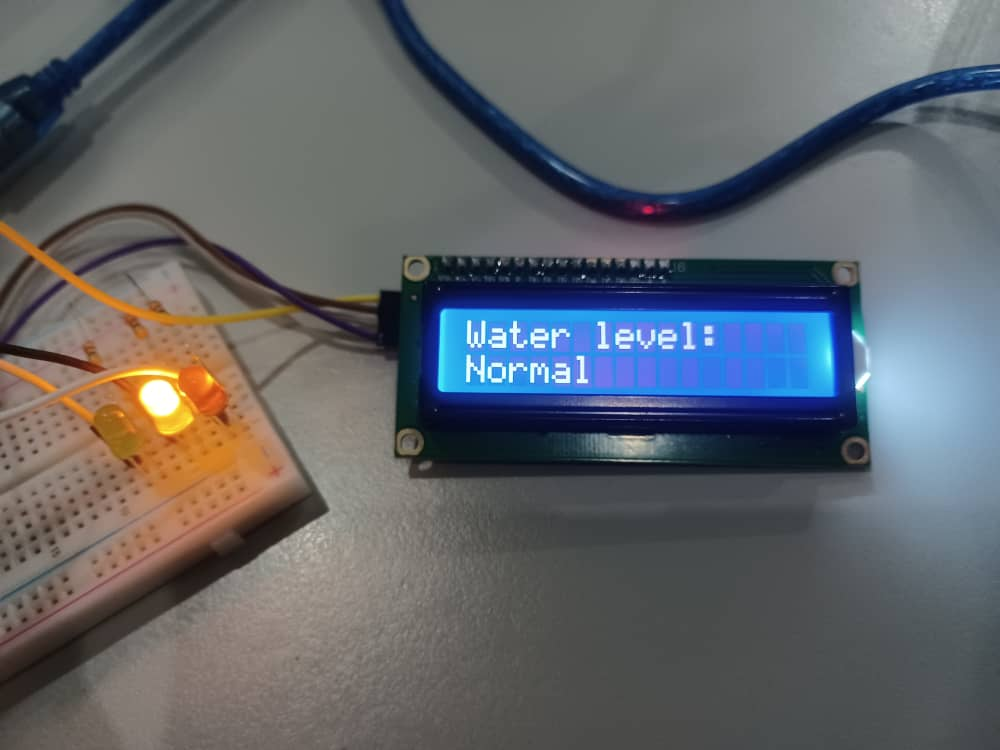
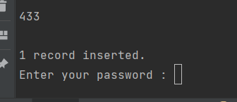
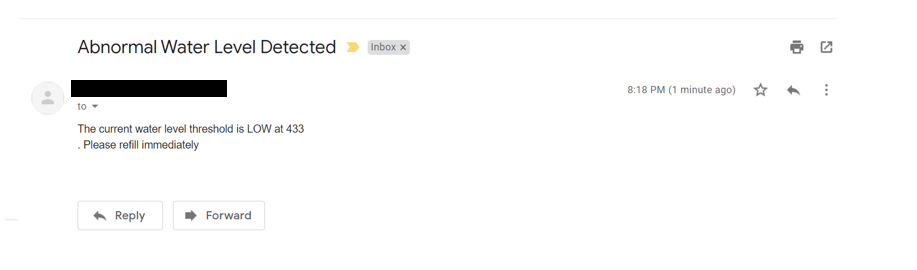

# Real-Time-Water-Level-Alert-With-Arduino
A combination of Arduino, Python and SQL to trigger an email when the water level hits a certain limit by utilizing the serial port.

# Create the Schematics

Required Components: 
-Arduino Mega 2560 X 1 
-LCD 16X2 I2C X 1 
-Water Level Sensor X 1 
-LED X 3

# Construct the SQL Table Structure

Create a new schema called sensor with a table called sensordata with the following columns: 
-Timestamp (datetime) 
-Value (int) 
-Status (varchar)  

# Explanation of the Arduino Code
The code will continuously read the value of the water sensor and change the output of the LCD based on the input where 0 to 20 will be empty, 20 to lowerlimit 
will be low, lowerlimit to upperlimit will be normal, and more than upperlimit will be full. The LED will light up according to the values as well where RED will
be displayed when the water level is empty or low, yellow for normal and green for high. 

# Sample Output when the Water Level is Low

# Sample Output when the Water Level is Normal

# Explanation of the Python Code
The code will continuously read the value of the water sensor from the serial port and will insert a new row into the sql database if there is a change in the status
of the water level. If the water level changes from normal or high to low, an email will be triggered to a recipient to notify them that the current water level 
threshold is low. An input for the password to the sender's email will be prompted before the alert is being triggered. 

# Sample of Trigger for Alert

# Sample Email Output

